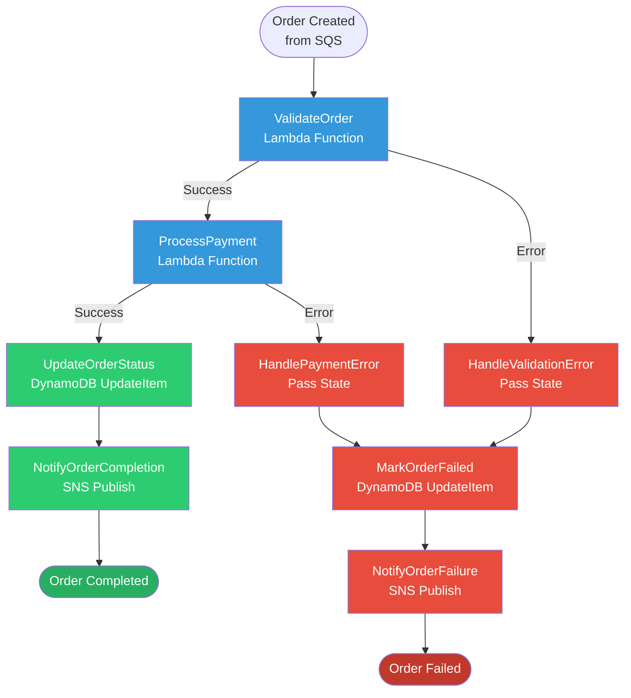

# Order Processing Workflow - Visual Guide

## Complete Workflow Diagram



## States Explained

### 1. ValidateOrder (Lambda Task)
**Type**: Lambda Function  
**File**: `dev1-backend-core/lambdas/validate_order_handler/app.py`

**What it does**:
- ✅ Checks required fields (orderId, userId, items, totalAmount)
- ✅ Validates products exist in DynamoDB ProductsTable
- ✅ Checks stock availability
- ✅ Verifies prices match database
- ✅ Validates total amount calculation

**Input Example**:
```json
{
  "orderId": "order-123",
  "userId": "user-456",
  "items": [
    {"productId": "prod-1", "quantity": 2, "price": 29.99}
  ],
  "totalAmount": 59.98
}
```

**Output on Success**:
```json
{
  "orderId": "order-123",
  "userId": "user-456",
  "items": [...],
  "totalAmount": 59.98,
  "validationResult": {
    "isValid": true,
    "errors": [],
    "validatedAt": "request-id-123"
  }
}
```

**Error Handling**:
- **Retry**: 3 attempts with exponential backoff (2s, 4s, 8s) for Lambda service errors
- **Catch**: All errors caught and routed to HandleValidationError

---

### 2. ProcessPayment (Lambda Task)
**Type**: Lambda Function  
**File**: `dev1-backend-core/lambdas/process_payment_handler/app.py`

**What it does**:
- 💳 Processes payment (currently mock - 90% success rate)
- 🔑 Generates transaction ID
- ⏱️ Simulates payment gateway delay (200ms)
- 🎲 Randomly fails 10% for testing error paths

**Output on Success**:
```json
{
  "paymentResult": {
    "status": "success",
    "transactionId": "txn-abc123def456",
    "processedAt": "2024-01-16T10:00:00Z",
    "provider": "mock-payment-gateway",
    "message": "Payment of $59.98 processed successfully"
  }
}
```

**Error Handling**:
- **Retry**: 2 attempts with exponential backoff for Lambda service errors
- **Catch**: Payment failures caught and routed to HandlePaymentError

---

### 3. UpdateOrderStatus (DynamoDB Task)
**Type**: Direct DynamoDB Integration  
**Resource**: `arn:aws:states:::dynamodb:updateItem`

**What it does**:
- 📝 Updates order in OrdersTable
- ✅ Sets status to "COMPLETED"
- 🕒 Records timestamp
- 💳 Stores transaction ID

**DynamoDB Update**:
```
SET orderStatus = "COMPLETED",
    updatedAt = "2024-01-16T10:00:00Z",
    paymentTransactionId = "txn-abc123def456"
```

**Error Handling**:
- **Retry**: 3 attempts with exponential backoff for DynamoDB throttling

---

### 4. NotifyOrderCompletion (SNS Task)
**Type**: Direct SNS Integration  
**Resource**: `arn:aws:states:::sns:publish`

**What it does**:
- 📧 Publishes success notification to SNS topic
- 👤 Can be subscribed to email, SMS, or Lambda

**Notification Message**:
```json
{
  "orderId": "order-123",
  "userId": "user-456",
  "status": "COMPLETED",
  "totalAmount": 59.98,
  "transactionId": "txn-abc123def456",
  "message": "Your order has been processed successfully!"
}
```

---

### Error Path States

#### HandleValidationError & HandlePaymentError (Pass States)
**Type**: Pass State (Data Transformation)

**What they do**:
- 🔄 Extract error information
- 📋 Format error details
- ➡️ Pass to MarkOrderFailed state

#### MarkOrderFailed (DynamoDB Task)
**What it does**:
- ❌ Updates order status to "FAILED"
- 📝 Records error reason
- 🕒 Timestamps the failure

#### NotifyOrderFailure (SNS Task)
**What it does**:
- 📧 Sends failure notification
- 💬 Includes error details
- 👥 Notifies customer of failure

---

## Data Flow Example

### Success Path
```
Input:
{
  "orderId": "order-001",
  "userId": "user-123",
  "items": [{"productId": "prod-1", "quantity": 1, "price": 49.99}],
  "totalAmount": 49.99
}

↓ ValidateOrder

{
  ...input data...,
  "validationResult": {"isValid": true, "errors": []}
}

↓ ProcessPayment

{
  ...previous data...,
  "paymentResult": {"status": "success", "transactionId": "txn-xyz"}
}

↓ UpdateOrderStatus

DynamoDB: orderId=order-001, status=COMPLETED, txnId=txn-xyz

↓ NotifyOrderCompletion

SNS: "Order order-001 completed successfully!"
```

### Failure Path (Payment Failed)
```
Input: Same as above

↓ ValidateOrder ✅

↓ ProcessPayment ❌ (Failed)

↓ HandlePaymentError

{
  "errorInfo": {
    "orderId": "order-001",
    "error": "PAYMENT_FAILED",
    "errorDetails": {...}
  }
}

↓ MarkOrderFailed

DynamoDB: orderId=order-001, status=FAILED, errorReason=PAYMENT_FAILED

↓ NotifyOrderFailure

SNS: "Order order-001 failed: Payment could not be processed"
```

---

## How to Test

### 1. Test Successful Order
```json
{
  "orderId": "test-001",
  "userId": "user-123",
  "items": [
    {"productId": "prod-1", "quantity": 1, "price": 29.99}
  ],
  "totalAmount": 29.99
}
```

**Expected**: Complete successfully, update DynamoDB, send success SNS

### 2. Test Validation Error
```json
{
  "orderId": "test-002",
  "userId": "user-123",
  "items": [],
  "totalAmount": 0
}
```

**Expected**: Fail at ValidateOrder, mark as FAILED, send failure SNS

### 3. Test Payment Error
Run successful test multiple times (10% will fail randomly)

**Expected**: Some executions fail at ProcessPayment, handled gracefully

---

## Monitoring Your Workflow

### AWS Console: Step Functions
1. Go to AWS Console → Step Functions
2. Find `dev-OrderProcessingWorkflow`
3. Click to see visual diagram (looks like the mermaid diagram above!)
4. View executions and their status

### CloudWatch Logs
- `/aws/lambda/dev-ValidateOrderFunction` - Validation logs
- `/aws/lambda/dev-ProcessPaymentFunction` - Payment logs
- `/aws/states/dev-OrderProcessingWorkflow` - Step Functions execution logs

### Key Metrics to Monitor
- ✅ **Execution Success Rate**: Should be ~90% (due to mock payment failures)
- ⏱️ **Execution Duration**: Typically 1-2 seconds
- ❌ **Error Rate by State**: See which states fail most often
- 💰 **Cost per Execution**: Very low (~$0.000025 per execution)

---

## Next Steps to Learn

1. **Deploy and test** this workflow
2. **View execution in AWS Console** - see the visual flow!
3. **Check CloudWatch Logs** - understand what each function does
4. **Try both success and error scenarios**
5. **Replace mock payment** with real payment gateway in production
6. **Add more states** - inventory reduction, order tracking, etc.

---

**Congratulations!** You now have a production-ready order processing workflow with error handling! 🎉
